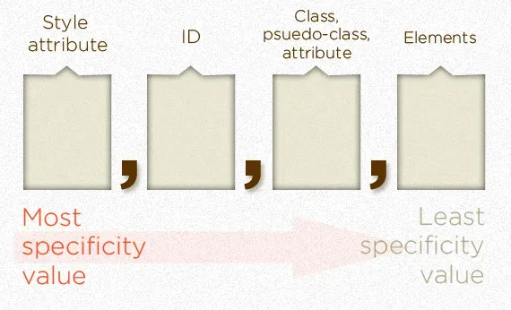

# Conflict resolution

If there are two or more rules that apply to the same element, this conflict is solved like this:

1. SPECIFICITY: The most specific selector combination wins.
2. LAS RULE: If two rules have the same specificity and are in conflict, the last declaration wins.

- An inline style always wins (value of 1000)
- You can add a `!important` after any property value to make it the one to apply over any other else, but generally is not recommended.
- In case there is no conflict, the rules merge.
- The universal selector (*) has no specificity value (0,0,0,0)

## How to calculate specificity

The weight of the left value is the higher, and the right value, the lowest.

# Links

[External article](https://css-tricks.com/specifics-on-css-specificity/)

[example1](./conflict-resolution/index1.html)

[example2](./conflict-resolution/index2.html)

[example3](./conflict-resolution/index3.html)